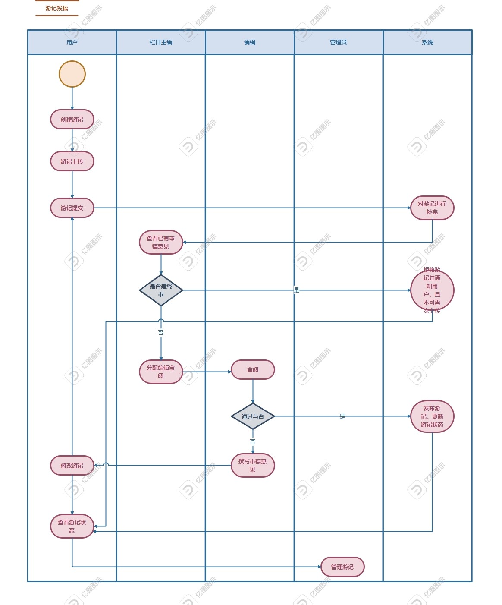
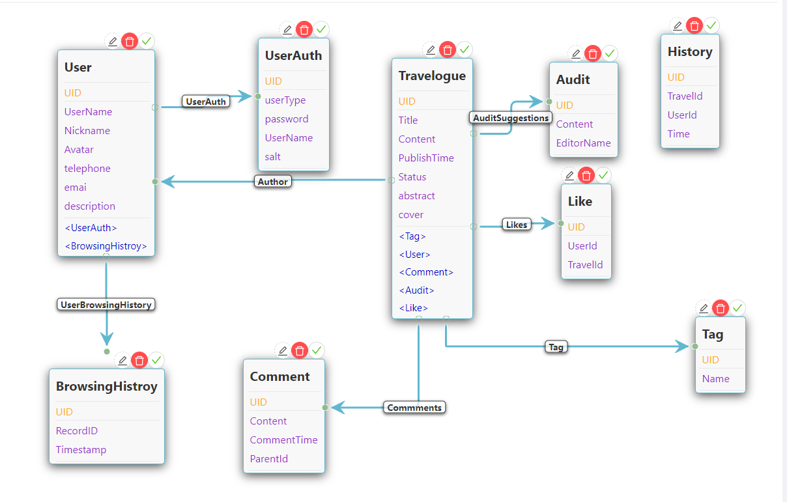

# 交游记（基于手机的游记展示系统）

- [交游记（基于手机的游记展示系统）](#交游记基于手机的游记展示系统)
  - [项目简介](#项目简介)
  - [项目背景](#项目背景)
  - [流程及主要场景](#流程及主要场景)
  - [实现技术架构](#实现技术架构)
  - [数据模型](#数据模型)
  - [算法逻辑](#算法逻辑)
    - [1.密码加盐（password salting）](#1密码加盐password-salting)
      - [算法概述](#算法概述)
      - [算法实现](#算法实现)
    - [2.基于物品的协同过滤算法(Item-Based Collaborative Filtering)](#2基于物品的协同过滤算法item-based-collaborative-filtering)
      - [算法概述](#算法概述-1)
      - [算法流程](#算法流程)
      - [算法实现](#算法实现-1)
    - [3.其余推荐算法](#3其余推荐算法)
      - [3.1基于热度的推荐算法](#3.1基于热度的推荐算法)
      - [3.2基于时间的推荐算法](#3.1基于时间的推荐算法)
    - [4.敏感词过滤算法](#4.敏感词过滤算法)
      - [算法概述](#算法概述-2)
      - [算法实现](#算法实现-2)
  - [主要创新之处](#主要创新之处)
  - [成员分工](#成员分工)

## 项目简介

&nbsp;&nbsp; &nbsp; &nbsp;  游记评阅系统为个人旅游文章的投稿、评审、评价及管理提供了一个网络平台。首先
是用户通过该平台上传游记，编辑进行审稿，若最终确定通过则将游记发布在平台上，以
供其他用户进行查阅及评价，平台管理员可以有统计分析分析等功能。

## 项目背景

&nbsp;&nbsp; &nbsp; &nbsp;数据智能方向《智能大数据平台》基于RMP平台的小组作业，。

## 流程及主要场景

&nbsp;&nbsp; &nbsp; &nbsp;游记泳道图如下：

## 实现技术架构
- web端：React+Antd design
- 后端 & 数据库：RMP平台
- 移动端：待定
## 数据模型

&nbsp; &nbsp; &nbsp; 

### 数据库设计

#### 1.用户表（存储用户的基本信息）

- ​	**UserName** - string 用户名，唯一，非空。
- ​	**Nickname** - string 昵称，非空。
- ​	**Avatar** - string (base64编码字符串） 头像，非空。
- ​	**telephone** - string 可以为空 
- ​	**email** - string 可以为空
- ​	**description** - string 可以为空

#### 2.用户权限表（用户存放用户权限和隐私信息，因为不属于用户的本质属性）

- ​	**userType** - int 0代表管理员，1代表用户，2代表编辑，3代表主编，-1代表黑名单用户，被禁止登陆了，只有管理员有权限解禁
- ​	**UserName** -string 用户名
- ​	**password** -string 密码
- ​	**salt** - string 盐值

#### 3.游记表（储存游记基本信息）

- ​	**Title** - string 游记标题
- ​	**Content** - string 游记正文
- ​	**PublishTime** - string 游记发布时间
- ​	**Status** - int 游记状态，0代表本地草稿，1代表已上传待分配审核，2代表已分配待审核，3代表已通过，4代表未通过，5代表被管理员撤回
- ​	**abstract** - string 游记简介
- ​	**cover** - string 游记封面

#### 4.评论表（储存用户评论）

- ​	**Content** - string 评论内容
- ​	**CommentTime** - string 评论时间
- ​	**ParentId** - int 评论的游记号

#### 5.点赞表（储存点赞信息）

- ​	**UserId** - int 点赞人
- ​	**TravelId** - int 点赞的游记id

#### 6.审核表（储存审核信息）

- ​	**Content** - String 审核内容
- ​	**EditorName** - String 编辑姓名

#### 7.标签表（储存选择的标签）

- ​	**Tag** - String 标签名

#### 8.历史记录表（储存历史记录）

- ​	**TravelId** - int 看过的游记的id
- ​	**UserId** - int 浏览者id
- ​	**Time** - 浏览时间

## 实现业务

### 1.游记投稿场景

​	投稿流程是该平台的重要业务流程，涉及游记的创建、上传、提交以及对游记进行修改等一些过程，目的完成游记的信息输入。

#### 实现内容

- ​	作者通过网站提交游记，游记文章包含标题、作者、标签、封面、以及正文信息，作者还可以选择是否提交，可以保存在草稿箱中下次继续编辑；
- ​	系统接受到游记后，对文章进行补完，获取当前时间，附上时间标签，自增游记编号，设置状态为1（已上传等待分配审核）；
- ​	文章提交以后可以在个人主页查看自己已提交游记的审核状态意见，若被发现已经被打回，可以进行修改重新提交；
- ​	个人页面还展示历史记录和喜爱列表；

### 2.游记审稿场景

​	审稿流程是该系统的核心业务流程，涉及编辑对游记进行审阅。

#### 实现内容

- ​	栏目主编分配编辑对游记进行审阅，并可以查看所有游记的审核状态及意见；
- ​	若游记评审通过，则将文章发布在平台上；

### 3.游记评价场景

#### 实现内容

- ​	阅读用户可以查询所有已发布的游记，支持条件查询（如关键字、标签、作者、发表 年份等信息）；
- ​	用户可以在游记发布后，对游记进行评价和评述；
- ​	游记发布后，游记作者可以查看自己所著游记的详细信息，包括关联信息；

### 4.游记归档及平台管理场景

#### 实现内容

## 算法逻辑

### 1.密码加盐（password salting）

#### 算法概述

- 密码加盐（password salting）是一种增强密码存储安全性的技术。它通过在用户密码的基础上添加一个随机生成的值（盐），然后将密码和盐一起进行哈希运算，生成最终的存储密码。
- 密码加盐的目的是为了防止常见的密码攻击，特别是彩虹表攻击（rainbow table attack）。彩虹表是一种预先计算并存储大量密码哈希值的技术，攻击者可以使用彩虹表来快速破解存储的密码哈希。如果不使用盐值，相同的密码在哈希运算后会生成相同的哈希值，这使得彩虹表攻击变得非常有效。
- 通过使用盐值，每个用户的密码哈希都将是唯一的，即使两个用户使用相同的密码，由于盐值的不同，生成的哈希值也会不同。这使得攻击者无法简单地使用预先计算好的彩虹表来破解密码。
- 盐值通常是随机生成的，并且与每个用户的密码一起存储在数据库中。在验证用户登录时，系统会提取存储的盐值，并将其与用户输入的密码一起进行哈希运算，然后与数据库中存储的密码哈希进行比较来验证密码的正确性。

#### 算法实现

- 主要靠bcryptjs库实现
- 安装：npm install bcryptjs
- 引入：const bcrypt = require('bcryptjs');
- 加盐：const salt = bcrypt.genSaltSync(10);
- 加密：const hash = bcrypt.hashSync(password, salt);
- 验证：const isMatch = bcrypt.compareSync(password, hash);
- 详细代码见：src/View/RegisterView.js
### 2.基于物品的协同过滤算法(Item-Based Collaborative Filtering)
#### 算法概述
- 基于物品的协同过滤算法通过计算不同用户对不同物品的评分获得物品间的关系，基于物品间的关系对用户进行相似物品的推荐，评分即代表用户对物品的态度和偏好。比如，用户A同时购买了物品x，y，那么说明x，y之间的相关度高，当用户B也购买了物品x时，那么可以预测B也可能买物品y。
#### 算法流程
- 1）根据用户与物品的喜好矩阵，构建用户–>物品的倒排（即倒查表）；
- 2）构建物品与物品的共现矩阵；
- 3）计算物品之间的相似度，即计算相似矩阵
- 4）根据用户的历史记录，给用户推荐物品
#### 算法实现
拟实现基于物品的协同过滤算法，会根据用户之间点赞的游记计算游记之间的相似度，然后给用户推荐相似度最高的游记，具体实现见recommendUtil.js中的ItemBased_Collaborative_Filtering。
### 3.其余推荐算法
#### 3.1 基于热度的推荐算法
- 基于热度的推荐算法是根据用户的历史行为，将浏览量最高的TopN个游记推荐给用户
#### 3.2 基于时间的推荐算法
- 基于时间的推荐算法是将最近发布的TopN个游记推荐给用户
### 4.敏感词检测算法
## 主要创新之处
- 1.采用密码加盐技术，提高用户密码安全性
- 2.多种推荐算法，提高用户体验，包括基于物品的协同过滤算法，基于热度的推荐算法，基于时间的推荐算法
- 3.采用异步通信技术，提高用户体验
- TODO
## 成员分工
| 成员  | 分工                                                                                                                                     | 贡献度  |
|-----|----------------------------------------------------------------------------------------------------------------------------------------|------|
| 徐国洪 | **文档**： 需求分析，需求分析文档撰写，数据库设计，架构文档主要撰写，说明文档编写；**功能实现**：1.页面路由导航，权限鉴定 2.ajax跨域异步通信  3.登录注册（密码加盐）功能实现 4.推荐算法的实现**页面设计**：主页，文本编辑页，登录页，游记详情页 | TODO |
| 陈煜  | **文档**： 需求分析文档审核，软件架构文档部分撰写；**功能实现**：1.游记上传,**页面设计**：个人中心页，编辑（editor）页                                                                 | TODO |
| 闫涵  | **文档**： 需求分析文档审核，软件架构文档审核；**功能实现**：1.用户权限管理，删除账号 2.撤销游记，**页面设计**：注册页面，管理员页面                                                                            | TODO |
